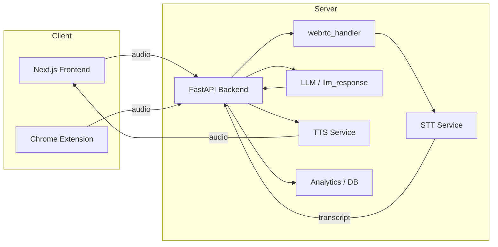

# Voice AI Study Buddy

A full-stack speech recognition and voice-assistant project with a FastAPI backend, a Next.js frontend, and a Chrome extension for microphone setup and capture.

## Features

- Real-time speech-to-text (STT) and streaming via WebRTC
- Conversation and chat handling with history and analytics
- Text-to-speech (TTS) support
- Evaluation tooling for transcripts and LLM responses
- Chrome extension to capture audio from the browser

## Repository Layout

- `backend/` — FastAPI server, STT/TTS handlers, routes, and analytics
- `frontend/` — Next.js app and React components
- `chrome-extension/` — Unpacked Chrome extension for mic setup and audio capture
- `docker-compose.yml` — optional multi-service configuration

Key backend files:

- [backend/main.py](backend/main.py) — application entry
- [backend/fastapi_server.py](backend/fastapi_server.py) — FastAPI app and routes
- [backend/api.env](backend/api.env) — environment variables (example)

Frontend entry:

- [frontend/app/page.tsx](frontend/app/page.tsx)

## Prerequisites

- Python 3.10+ (or your project's specified version)
- Node.js 18+ and npm (or yarn)
- Chrome (for the extension) if you plan to use the browser capture

## Backend Setup

1. Create and activate a virtual environment (from repo root):

```bash
python -m venv backend/.venv
source backend/.venv/bin/activate
```

2. Install Python dependencies:

```bash
pip install -r backend/requirements.txt
```

3. Configure environment variables:

- Copy or edit [backend/api.env](backend/api.env) with your keys and settings.

4. Run the backend (development):

```bash
cd backend
uvicorn fastapi_server:app --host 0.0.0.0 --port 8000 --reload
```

## Frontend Setup

1. Install dependencies and run the Next.js app:

```bash
cd frontend
npm install
npm run dev
```

2. Open the app at `http://localhost:3000` (or the port shown by Next.js).

## Chrome Extension

1. Open Chrome → Extensions → Load unpacked
2. Select the `chrome-extension/` folder
3. Use the extension's mic setup and audio capture pages for testing

## Running End-to-End

1. Start the backend (see Backend Setup).
2. Start the frontend (see Frontend Setup).
3. Optionally load the Chrome extension for in-browser audio capture.

## Development Notes

- API routes are in `backend/routes/` and handler logic in `backend/webrtc_handler.py` and related modules.
- STT code lives in `backend/stt/` and TTS in `backend/text_to_speech/`.
- Analytics and evaluation helpers are in `backend/analytics/` and `backend/evaluation/`.

## Architecture

This project is organised as a typical full-stack voice assistant with clear separation of concerns:

- Client (Frontend + Chrome extension):
	- Next.js frontend (`frontend/`) provides the UI, playback, and controls.
	- Chrome extension (`chrome-extension/`) can capture browser audio and send it to the backend for processing.

- Server (Backend):
	- FastAPI app (`backend/fastapi_server.py`, `backend/main.py`) accepts WebSocket/WebRTC connections, REST routes, and coordinates STT/TTS flows.
	- `webrtc_handler.py` manages media streams and signaling for real-time audio.
	- `stt/` contains speech-to-text integration and streaming logic.
	- `text_to_speech/` provides TTS rendering for assistant responses.
	- `analytics/` and `evaluation/` collect metrics and evaluate transcripts/LLM responses.

- Data & Flow:
	1. User records or streams audio from the browser (frontend or extension).
	2. Audio is forwarded to the FastAPI backend via WebRTC or WebSocket.
	3. Backend routes audio to STT; interim transcripts are streamed back to the client.
	4. Transcripts may be processed by LLMs or business logic in `llm_response/` and stored or evaluated.
	5. When needed, TTS renders spoken responses and streams them back to the client.

This modular architecture lets you replace STT, TTS, or LLM providers with minimal changes, and scales by separating real-time media handling from stateless API endpoints.

### Architecture Diagram



The diagram shows client components sending audio to the backend, where real-time handling, STT, LLM processing, TTS, and analytics occur.

## Contributing

Feel free to open issues or pull requests. For local contributions:

- Follow the setup steps above for backend and frontend
- Run linting and tests (add test commands as project grows)

## License

This project is available under the MIT License — see [LICENSE](LICENSE).

---

If you'd like, I can add a Quickstart section with example requests, or expand the API documentation using OpenAPI specs from the running backend. Want me to do that next?
